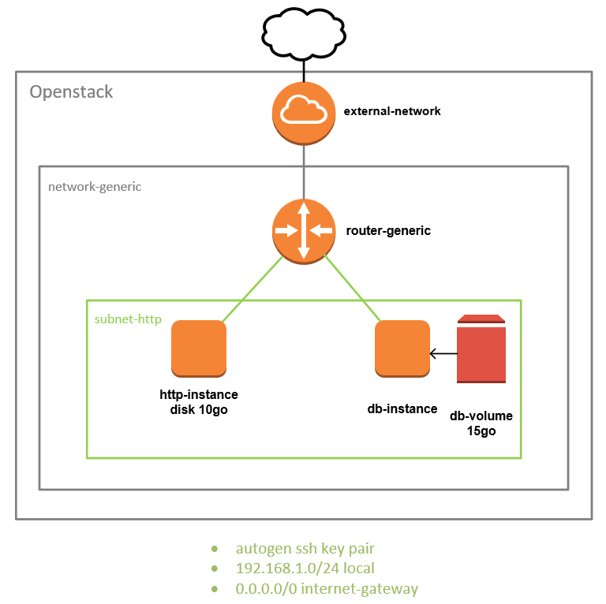

# How to



### Create stack

```
terraform apply
```

This script will create:
-   1 router
-   1 network
-   1 root volume
-   1 instance with attached root volume

### delete stack

```
terraform destroy
```
