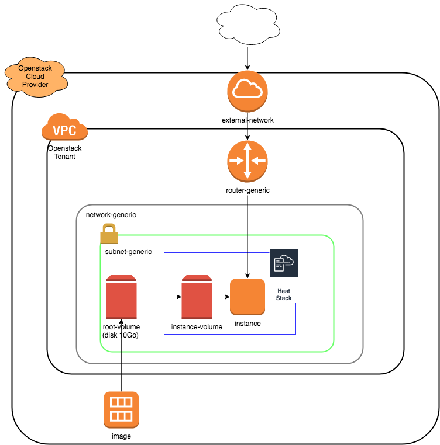

# How to



- This sample create with terraform the following architecture:
- Create router/network/volume and heat stack resources
- heat stack create an instance with root volume attached, and execute user_data at boot time.
  Waitcondition in heat allow to trigger orchestration service and inform about the status of the stack (succes or failure)

### Create stack

```
terraform apply
```

This script will create:
-   1 router
-   1 network
-   1 volume from image
-   1 stack with 1 instance with attached volume, and user_data with waitcondition

### delete stack

```
terraform destroy
```

### In case of stack creation error
import the failed stack then destroy it

```
# get stack id
openstack stack list
# import stack in terraform
terraform import "openstack_orchestration_stack_v1.stack_1" _STACK_UUID_TO_IMPORT_
# destroy
terraform destroy --target=openstack_orchestration_stack_v1.stack_1
```
